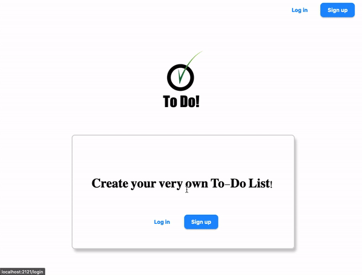

- [Live Link](https://jolly-pocket-ant.cyclic.app/)

# Team 

- Beverly Andrews -> bell#4821
- Phillip         -> psiu#1360
- Max      -> maxed__out#0010
- Jake           -> jakub#9925
- Erick Felix     -> efs0#7437

# Introduction

A Simple ToDo App is built using the MVC Architecture, we have also implemented "authorization" so folx can sign up, customize & personalize the app 

---

> Be sure to add that lovely star 😀 and fork it for your own copy

---

# Objectives

- Work as a team and utilize MVC arquitecture, 
---

# Who is this for? 

- It's for beginners & intermediates with little more experience, to help understand the various aspects of building a node app with some complex features

---

# Packages/Dependencies used 

bcrypt, connect-mongo, dotenv, ejs, express, express-flash, express-session, mongodb, mongoose, morgan, nodemon, passport, passport-local, validator

---

# Install all the dependencies or node packages used for development via Terminal or visit live link above!

`npm install` 

---

# Things to add

  - Create a `.env` file and add the following as `key: value` 
  - PORT: 2121 (can be any port example: 3000) 
  - DB_STRING: `your database URI` 
  
 ---
 
 Have fun testing and improving it! 😎

